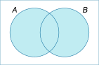
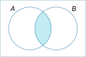
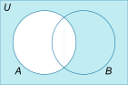

## Math

Why would you want to know basic math? Well, doesn't matter what you think, math is undercover of everything computer related. It will help you take all sorts of computer processes from the realm of magic to relatively understandable concepts. It's not something very crucial to become a developer, some of math concepts are used intuitively, like `boolean algebra` and some `logic`, and I'd even recommend skipping this part if you're completely new to programming. 

### 1 Intro

Discrete math, as the name implies, deals with discontinuous mathematics, structures that have distinct and separate elements with not gaps between them, e.g.: natural numbers, sets, graphs, sequences, etc. Nowadays, in computer science, the term "continuous" is mostly used in the field of analog devices, while discrete in the case of digital ones. 

Before we start, let's remember some basic math concepts: `set of natural numbers`, also know as $\N$, is a set of all positive integers, starting from 1. $\N = \{1, 2, 3, 4, 5, ...\}$. In discrete math, we'll be using a set of natural numbers, starting from 0, $\N_0 = \{0, 1, 2, 3, 4, 5, ...\}$.

We also know a `set of integers`, $\Z = \{..., -3, -2, -1, 0, 1, 2, 3, ...\}$, `set of rational numbers`, $\mathbb{Q} = \{\frac{p}{q} | p \in \Z, q \in \N\}$, `set of real numbers`, $\R = \mathbb{Q} \cup \mathbb{I}$, and `set of irrationals`, $\mathbb{I} = \{x \in \R | x \notin \mathbb{Q}\}$ (e.g.: $\sqrt{2}$). There is also a `set of complex numbers`, $\mathbb{C} = \{a + bi | a, b \in \R\}$, where $i = \sqrt{-1}$.

Almost everything in discrete mathematics is described using $\N_0$ and $\Z$ sets.

---

#### 1.1 Sets, posets, its properties and operations

We will have a rule, that set names are capital letter, e.g.: $A, B, C, D, \dots$ and set elements are small letters, e.g.: $a, b, c, d, \dots$. The case that element $a$ belongs to the set $A$ we will write in the form: $a \in A$. If element $a$ doesn't belong to the set $A$, we will write: $a \notin A$.

We create sets with different ways:
- `enumeration`: $A = \{1, 2, 3, 4, 5\}$,
- `set builder notation`: $B = \{x \in \N_0 | x < 10, x \;is\;even\}$,

We can also create sets using other sets:
- `union`: $A \cup B = \{x | x \in A \lor x \in B\}$,

- `intersection`: $A \cap B = \{x | x \in A \land x \in B\}$,

- `difference`: $A \setminus B = \{x | x \in A \land x \notin B\}$,

- `complement`: $\overline{A} = \{x | x \notin A\}$.

- `symmetric difference`: $A \triangle B = (A \setminus B) \cup (B \setminus A)$.

The general finite, nonempty set $A$ is usually written as $A = \{a_1, a_2, \dots, a_n\}$, where $n$ is the number of elements in the set $A$, where $n \in \mathbb{N}$. General infinite, nonempty set $A = \{a_1, a_2, \dots, a_n, \dots\}$ or $A = \{a_1, a_2, \dots\}$ if $n$ is unknown.

Number of elements in the set $A$ is called `cardinality` of the set $A$ and is denoted as $|A|$. If $|A| = 0$, then $A$ is called `empty set` and is denoted as $\emptyset$. Examples: $A = \{1, 2, 3, 4, 5\}$, $|A| = 5$, $B = \{1, 2, 3, 4, 5, 6, 7, 8, 9, 10\}$, $|B| = 10$, $C = \{1, 2, 3, 4, 5, 6, 7, 8, 9, 10, 11, 12, \dots\}$, $|C| = \infty$, $\emptyset = \{\}$, $|\emptyset| = 0$.

$X$ is a subset of $Y$, if $\forall x (x \in X, x \in Y)$ (for every $x (x \in X, x \in Y)$), which we write as: $X \subseteq Y$. If $X \subseteq Y$ and $Y \subseteq X$, then $X$ and $Y$ are called `equal sets`, which we write as $X = Y$. If $X \subseteq Y$ and $X \neq Y$, then $X$ is called a `proper subset` of $Y$, which we write as $X \subset Y$.

If the elements of the set are also sets, then we will call them `system of sets`. `System of all subsets` of the set $X$ will be called $2^X$.

**Task 1**: Consider a set $A = \{x \in \mathbb{Z} : 2x^3 + 3x^2 - 3x -2 = 0\}$. Find $2^A$.

**Solution**: First, we have to find elements of set $A$. We can do it by solving the equation: $2x^3 + 3x^2 - 3x -2 = 0$. The solution $x=1$ is easily visible, we can try to factorize $x - 1$. We get: $(x - 1)(2x^2 + 5x + 2) = 0$, it can futher be factored: $(x - 1)(2x + 1)(x + 2) = 0$, from that we get: $x_1 = 1$, $x_2 = -\frac{1}{2}$, $x_3 = -2$, but because $A$ is a set of integers, we can remove $-\frac{1}{2}$ from $A$. So, $A = \{1, -2\}$. Now, we will calculate $2^A$, which is a system of all subsets of $A$. $2^A = \{\emptyset, \{1\}, \{-2\}, \{1, -2\}\}$. You can call it a set of unique combinations of elements of $A + \emptyset$. If we had $A$ as a set of real numbers ($\mathbb{R}$), then $2^A = \{\emptyset, \{1\}, \{-\frac{1}{2}\}, \{-2\}, \{1, -\frac{1}{2}\}, \{1, -2\}, \{-\frac{1}{2}, -2\}, \{1, -\frac{1}{2}, -2\}\}$. 

**A/N**: You can find how to factor polonomial in the Internet. Like [here](https://en.wikipedia.org/wiki/Polynomial#Division) or on YouTube.

While working with sets, it is a good idea to introduce the notion of universe or universal set $\mathbb{U}$. Then every set that comes into consideration (that we work with) is a subset of $\mathbb{U}$, where the set $\mathbb{U}$ characterizes some natural set. Concept universe is therefore relative. In mathematical analysis, it is often the set of real numbers $\mathbb{R}$, whereas in discrete mathematics it is usually $\mathbb{N}$, $\mathbb{N_0}$ or $\mathbb{Z}$. In Venn diagrams showed above, everything inside the rectangle is the universe $\mathbb{U}$. 

**Task 2**: Find a complements $\overline{\rm {A_{\mathbb{N}}}}$ and $\overline{\rm {A_{\mathbb{Z}}}}$ of the set $A = \{x \in \mathbb{N}: \frac{1}{x} \in [\frac{1}{5},\frac{1}{2}]\}$.

**Solution**: $\frac{1}{x} \in [\frac{1}{5},\frac{1}{2}]$ can be written as two different inequalities: $\frac{1}{x} \ge \frac{1}{5}$ and $\frac{1}{x} \le \frac{1}{2}$. We can solve them separately. $\frac{1}{x} \ge \frac{1}{5}$ can be written as $x \le 5$, and $\frac{1}{x} \le \frac{1}{2}$ can be written as $x \ge 2$. So, $A = \{2, 3, 4, 5\}$. $\overline{\rm {A_{\mathbb{N}}}} = \{1, 6, 7, 8, \dots\}$, $\overline{\rm {A_{\mathbb{Z}}}} = \{\dots, -2, -1, 0, 1, 6, 7, 8, \dots\}$. 

**A/N**: The endless sets can be more conveniently written in the form characteristic features of the elements of the set. For example, $\overline{\rm {A_{\mathbb{N}}}} = \{x \in \mathbb{N} | x = 1 \lor x \ge 6\}$ and $\overline{\rm {A_{\mathbb{Z}}}} = \{x \in \mathbb{Z} | x \le 1 \lor x \ge 6\}$.

We can also include `Cartesian product` into list of basic operations on sets. Cartesian product of sets $A$ and $B$ is a set of all ordered pairs $(a, b)$, where $a \in A$ and $b \in B$. Cartesian product of sets $A$ and $B$ is denoted as $A \times B$. $A \times B = \{(a, b) | a \in A, b \in B\}$. If $A = \{1, 2, 3\}$ and $B = \{a, b\}$, then $A \times B = \{(1, a), (1, b), (2, a), (2, b), (3, a), (3, b)\}$. If $A = \{1, 2, 3\}$ and $B = \{1, 2, 3\}$, then $A \times B = \{(1, 1), (1, 2), (1, 3), (2, 1), (2, 2), (2, 3), (3, 1), (3, 2), (3, 3)\}$. If $A = \{1, 2, 3\}$ and $B = \emptyset$, then $A \times B = \emptyset$. If $A = \emptyset$ and $B = \{1, 2, 3\}$, then $A \times B = \emptyset$. If $A = \emptyset$ and $B = \emptyset$, then $A \times B = \emptyset$.

**Task 3**: $Let\; A = \{\triangle, \square\}, B = \{1,3,5\}$ and $C = \{\clubs\}$. Determine the sets $A \times B$, $C \times B$, $B \times C$, $B \times C \times A$, $B^2$ and $A^3$.

**Solution**: $A \times B$ is the set of all ordered pairs where the element in the first position is from set $A$ and in the second position is from the set $B$. So that, we don't miss any subset, it's better to proceed systematically. First, we take the first element of $A$ and add all the elements of the set $B$ to it. We get pairs $(\triangle, 1)$, $(\triangle, 3)$ and $(\triangle, 5)$. Then we take the second element of $A$ and add all the elements of the set $B$ to it. We get pairs $(\square, 1)$, $(\square, 3)$ and $(\square, 5)$. So, $A \times B = \{(\triangle, 1), (\triangle, 3), (\triangle, 5), (\square, 1), (\square, 3), (\square, 5)\}$. $C \times B = \{(\clubs, 1), (\clubs, 3), (\clubs, 5)\}$. $B \times C = \{(1, \clubs), (3, \clubs), (5, \clubs)\}$. $B \times C \times A = \{(1, \clubs, \triangle), (1, \clubs, \square), (3, \clubs, \triangle), (3, \clubs, \square), (5, \clubs, \triangle), (5, \clubs, \square)\}$. $B^2 = B \times B = \{(1, 1), (1, 3), (1, 5), (3, 1), (3, 3), (3, 5), (5, 1), (5, 3), (5, 5)\}$. $A^3 = A \times A \times A = \{(\triangle, \triangle, \triangle), (\triangle, \triangle, \square), (\triangle, \square, \triangle), (\triangle, \square, \square), (\square, \triangle, \triangle), (\square, \triangle, \square), (\square, \square, \triangle), (\square, \square, \square)\}$.

**A/N**: Considering, you are not going to do exams on Discrete math, we will not dive deeper in this part (like mathematical general proofs, etc.). If you want to learn more, you can find a lot of information on the Internet.

---

#### 1.2 Sequences, sums and products
We can completely (linearly) arrange every finite set or multiset, i.e. we determine which element is first, second... etc. We therefor determine the order of each element in the set. In such ordered set we denote the first element as $a_1$, the second element as $a_2$ up to the general $n$-th element $a_n$. We will ordered set of $n$ elements $(a_1, a_2, \dots, a_n)$, where $a_i$ for $i = 1, 2, \dots, n$ are all elements of the specified set. 

We will call such an ordered set of length $n$ a `finite sequence`. We can rewrite it in the sum-like form: $(a_i)_{i=1}^n$, where $a_i$ is the $i$-th term of the sequence. We can write `infinite sequence` the same way: $(a_1, a_2, \dots, a_n, \dots)$ or $(a_1, a_2, \dots)$ or $(a_i)_{i=1}^\infty$.

**Task 4**: Calculate $\sum_{i=1}^n (i + 2)$.

**Solution**: First of all, we need to solve our sum: $\sum_{i=1}^n (i + 2) = (1 + 2) + (2 + 2) + (3 + 2) + \dots + (n + 2)$. We can rewrite it as: $3 + 4 + 5 + \dots + (n + 2)$, where $a_1 = 3$, $a_2 = 4$, $\dots$, $a_n = n + 2$. Lets remember formula for $n$ first elements of arithmetic progression: $S_n = \frac{n(a_1 + a_n)}{2} \implies$ $S_n = \frac{n(3 + n + 2)}{2} = \frac{n(n + 5)}{2}$. Answer: $\sum_{i=1}^n (i + 2) = \frac{n(n + 5)}{2}$.

**Task 5**: Calculate $\prod_{i=1}^n (i + 2)$.

**Solution**: First of all, we need to solve our product: $\prod_{i=1}^n (i + 2) = (1 + 2) \cdot (2 + 2) \cdot (3 + 2) \cdot \dots \cdot (n + 2)$. We can rewrite it as: $3 \cdot 4 \cdot 5 \cdot \dots \cdot (n + 2)$, where $a_1 = 3$, $a_2 = 4$, $\dots$, $a_n = n + 2$. We can see the pattern of the simplified product, which is a product of $n$ consecutive numbers: $3 \cdot 4 \cdot 5 \cdot \dots \cdot (n + 2) = \frac{(n + 2)!}{2!}$. Answer: $\prod_{i=1}^n (i + 2) = \frac{(n + 2)!}{2}$.

**A/N**: If you are confused why the answer is $\frac{(n + 2)!}{2!}$ and not just $(n+2)!$, you should pay attention to the fact that $3 \cdot 4 \cdot 5 \cdot \dots \cdot (n + 2)$ is only a part of $(n + 2)!$. In fact it's missing $1 \cdot 2$. While our product $\prod_{i=1}^n (i + 2)$ counts from $3$ to $n + 2$, $(n + 2)!$ counts from $1$ to $n + 2$. If we make product more general and replace cooficient $2$ with $a$, we will get: $\prod_{i=1}^n (i + a) = \frac{(n + a)!}{a!}$.

**Task 6**: Calculate $\sum_{i \in \{x \in \mathbb{R}:x^2 + x - 2 = 0\}} (i + a)$ and  $\prod_{i \in \{x \in \mathbb{R}:x^2 + x - 2 = 0\}} (i + a)$.

**Solution**: Let's start from $\sum$. As we see, the range of index values is in the form of characteristic features. First of all we have to solve them to find index values: $x^2 + x - 2$ = 0. We can factorize it: $(x + 2)(x - 1) = 0$, so $x_1 = -2$ and $x_2 = 1$. Now, we can calculate our sum: $\sum_{i \in \{x \in \mathbb{R}:x^2 + x - 2 = 0\}} (i + a) = (-2 + a) + (1 + a) = 2a - 1$. Now, let's calculate product. $\prod_{i \in \{x \in \mathbb{R}:x^2 + x - 2 = 0\}} (i + a) = (-2 + a) \cdot (1 + a) = a^2 - a - 2$.

**Task 7**: We deposited 1,000 EUR into a savings account. We know that they add up every year as many hundred EUR as the number of years the account has been maintained, and every year they deduct 200 EUR for the bank account fees. How many EUR will be in the savings account after:
- two years?
- five years?
- $n$ years?

**Solution**: First of all, lets find a solution for $n$. Sometimes, tasks like that with natural language description can be quite confusing, in that case it's good idea to parse them step-by-step, drawind tables, etc.; just to make task easier for yourself. So, we have 1,000 EUR, we add up every year $(nth \; year)\times 100$ and subtract 200. Let's make a table:

| Year  |            Money            |
| :---: | :-------------------------: |
|   1   | 1000 - 200 + 1 * 100 = 900  |
|   2   |  900 - 200 + 2 * 100 = 900  |
|   3   | 900 - 200 + 3 * 100 = 1000  |
|   4   | 1000 - 200 + 4 * 100 = 1200 |
|   5   | 1200 - 200 + 5 * 100 = 1500 |
|  ...  |             ...             |

Drawing a table we solved the task for $2$ and $5$ years. Now, we can see the pattern. We began with 1000, lets leave it be: $1000 + \dots$. Our fees are $200$ every year, so for $n$ years we will have $200 \cdot n$ in fees: $1000 - 200 \cdot n + \dots$. The last part is profit, every year the increment is increasing by $100$: $100 \cdot 1 + 100 \cdot 2 + \cdots + 100 \cdot n$, we can write it as a sum: $\sum_{i=1}^n 100 \cdot i$. Now, we can write our formula: $1000 - 200 \cdot n + \sum_{i=1}^n 100 \cdot i$. It can be rewritten as a sum of $n$ elements of arithmetic progression: $S_n = \frac{n(a_1 + a_n)}{2} = \frac{n(100 + 100n)}{2} = 50n(n+1)$. Answer: $1000 - 200 \cdot n + 50n(n+1) = 1000 + 50n(n - 3)$.

**Task 8**: Calculate: $\sum_{i=1}^n \sum_{j=1}^n i \cdot j$.

**Solution**: First of all, we are appling inner sum: $\sum_{i=1}^n i \cdot (1 + 2 + \cdots + n) = \sum_{i=1}^n i \cdot \frac{n(n+1)}{2} = \frac{n(n+1)}{2} \cdot \sum_{i=1}^n i = \frac{n(n+1)}{2} \cdot \frac{n(n+1)}{2} = \left(\sum_{i=1}^n i \right) ^ 2$.

---

#### 1.3 Upper and lower interer parts of , floor and ceiling functions

Upper integer part of real number number $a$ is an integer $z$, that: $z - 1 \lt a \le z$. We denote it as $\lceil a \rceil$ - a ceiling function. Lower integer part of real number number $a$ is an integer $z$, that: $z \le a \lt z + 1$. We denote it as $\lfloor a \rfloor$ - floor function.

**Task 9**: Find `ceil` and `floor` of given number: $7$, $7.1$, $7.5$, $7.9$, $-7$, $-7.1$, $-7.5$, $-7.9$, $e$, $-e$, $6.\overline{9}$.

**Solution**: $\lceil 7 \rceil = 7$, $\lfloor 7 \rfloor = 7$. $\lceil 7.1 \rceil = 8$, $\lfloor 7.1 \rfloor = 7$. $\lceil 7.5 \rceil = 8$, $\lfloor 7.5 \rfloor = 7$. $\lceil 7.9 \rceil = 8$, $\lfloor 7.9 \rfloor = 7$. $\lceil -7 \rceil = -7$, $\lfloor -7 \rfloor = -7$. $\lceil -7.1 \rceil = -7$, $\lfloor -7.1 \rfloor = -8$. $\lceil -7.5 \rceil = -7$, $\lfloor -7.5 \rfloor = -8$. $\lceil -7.9 \rceil = -7$, $\lfloor -7.9 \rfloor = -8$. $\lceil e \rceil = 3$, $\lfloor e \rfloor = 2$. $\lceil -e \rceil = -2$, $\lfloor -e \rfloor = -3$. $\lceil 6.\overline{9} \rceil = 7$, $\lfloor 6.\overline{9} \rfloor = 7$.

**A/N**: Why does $\lfloor 6.\overline{9} \rfloor = 7$? Because $6.\overline{9} = 7$. The proof is quite easy. Let $x = 6.\overline{9}$, then $10x = 69.\overline{9} \implies 10x - x = 69.\overline{9} - 6.\overline{9} \implies 9x = 63 \implies x = 7$.

That's it for Introduction to Discrete math part. Next chapter is Basic combinatorics.

---

### 2 Basic combinatorics

#### 2.1 Permutations without repetition